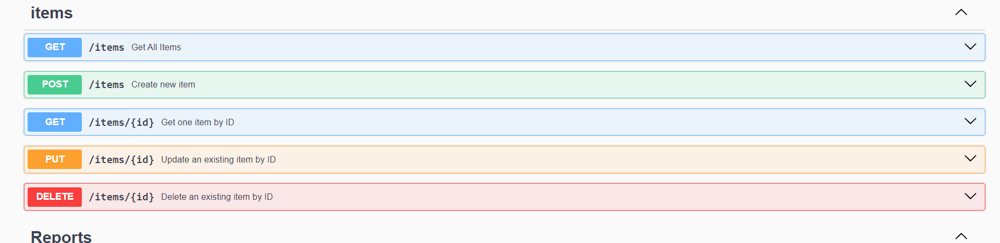
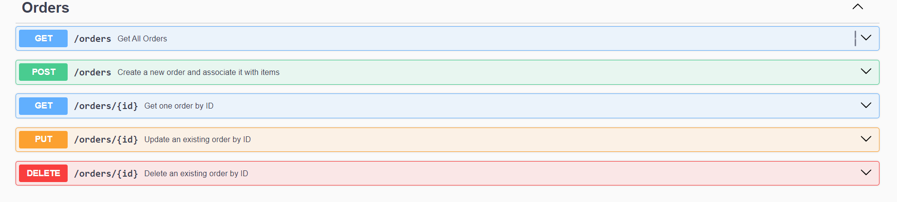
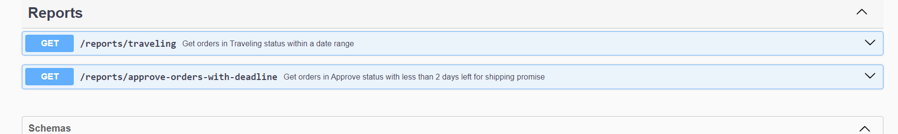

## Description

 This is a service developed with [Nest](https://github.com/nestjs/nest) Framework with the purpose of managing order orders, items and tracking the status of orders with two reports


## Requirements

- [Node](https://nodejs.org/)
- [Npm](https://www.npmjs.com/) (preferably) or [yarn](https://yarnpkg.com/)
- [Docker](https://www.docker.com/)

## Installation
You just have to run the docker command since the API and the database are in dockerized environments.
```bash
$ npm install
```

## .env file
```bash
POSTGRES_HOST=localhost
POSTGRES_PORT=5432
POSTGRES_USER=postgres
POSTGRES_PASSWORD=postgres
POSTGRES_DB=tiendamia
```

## Running the app

```bash
# Docker (recomended)
$ docker compose build
$ docker compose up
```

## Test

```bash
# unit test event
$ npx jest
```

## Swagger
### `/docs`
Items Module

Orders Module

Reports Module



